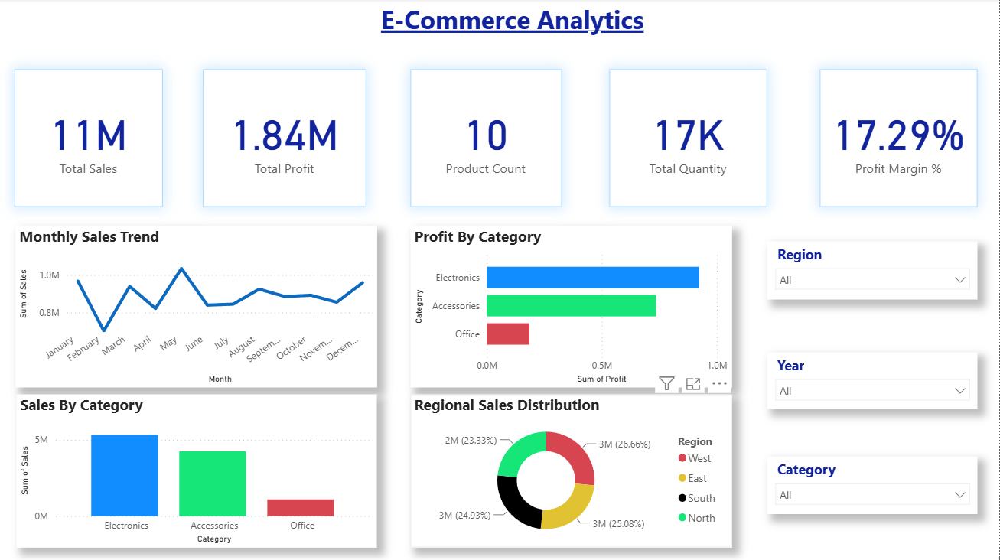
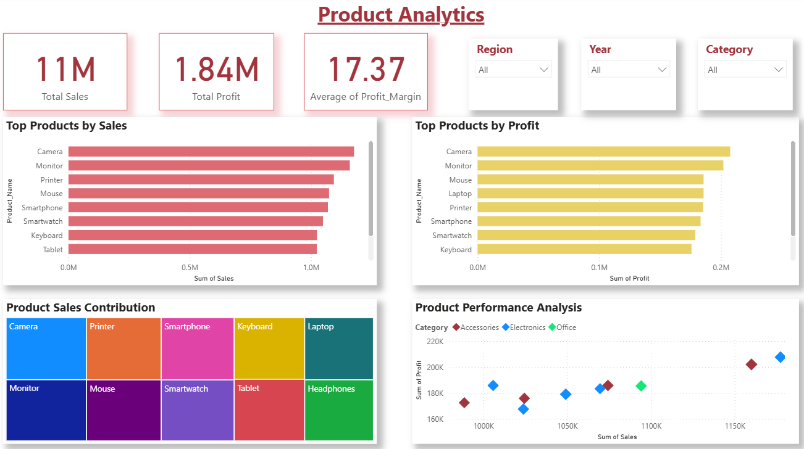
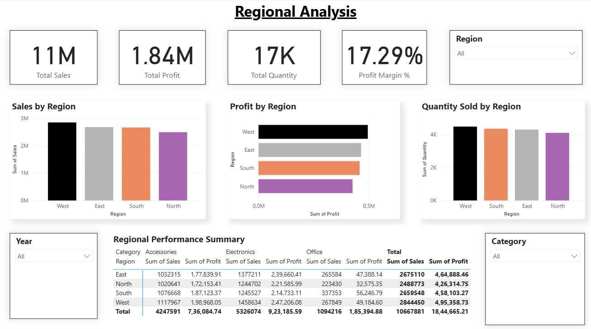
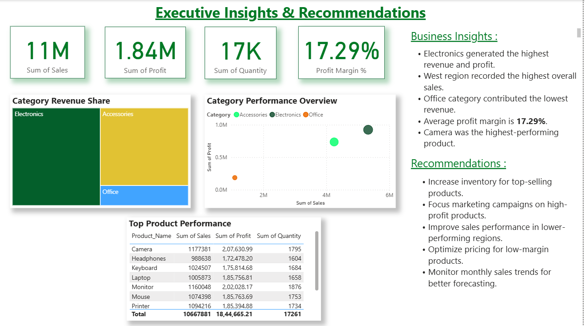

# 📊 E-Commerce Sales Analytics Dashboard

An end-to-end Data Analytics project that analyzes e-commerce sales data using **SQL, Python, and Power BI** to generate business insights through an interactive dashboard.

---

## 📌 Project Overview

This project demonstrates the complete data analytics workflow:

- Store and query sales data using MySQL
- Perform data cleaning and exploratory data analysis (EDA) using Python
- Generate automated EDA reports using Sweetviz
- Build an interactive dashboard in Power BI
- Extract meaningful business insights for decision making

---

## 🛠️ Tech Stack

- Power BI
- Python
- SQL (MySQL)
- Pandas
- NumPy
- Matplotlib
- Seaborn
- Sweetviz

---

## 📂 Repository Structure

```
E-Commerce-Sales-Analytics-Dashboard
│
├── data
│   ├── ecommerce_sales_data.csv
│   └── ecommerce_sales_cleaned.csv
│
├── sql
│   ├── analysis_queries.sql
│   └── .gitkeep
│
├── python
│   ├── eda.py
│   ├── auto_eda.py
│   └── .gitkeep
│
├── powerbi
│   ├── Ecommerce_Sales_Analytics_Dashboard.pbix
│   └── .gitkeep
│
├── reports
│   ├── EDA_Report.html
│   └── .gitkeep
│
├── images
│   ├── page1_overview.png
│   ├── page2_product_analysis.png
│   ├── page3_regional_analysis.png
│   ├── page4_executive_insights.png
│   └── .gitkeep
│
└── README.md
```

---

## 📈 Dashboard Pages

### 1️⃣ E-Commerce Analytics
- KPI Cards
- Monthly Sales Trend
- Sales by Category
- Profit by Category
- Regional Sales Distribution

### 2️⃣ Product Analytics
- Top Products by Sales
- Top Products by Profit
- Product Sales Contribution
- Product Performance Analysis

### 3️⃣ Regional Analysis
- Sales by Region
- Profit by Region
- Quantity by Region
- Regional Performance Summary

### 4️⃣ Executive Insights & Recommendations
- Business KPIs
- Key Insights
- Strategic Recommendations

---

## 📊 Key Metrics

- Total Sales
- Total Profit
- Product Count
- Total Quantity Sold
- Profit Margin %

---

## 📷 Dashboard Screenshots

### Dashboard Page 1



### Dashboard Page 2



### Dashboard Page 3



### Dashboard Page 4



---

## 📑 Files Included

- SQL Queries
- Python Analysis Script
- Automated EDA Report
- Power BI Dashboard (.pbix)
- Raw Dataset
- Cleaned Dataset

---

## ▶️ How to Run

1. Import the dataset into MySQL.
2. Execute the SQL queries.
3. Run the Python analysis script.
4. Generate the Sweetviz EDA report.
5. Open the Power BI (.pbix) file.

---

## 👨‍💻 Author

**Saravanan**

B.Tech – Artificial Intelligence & Data Science
